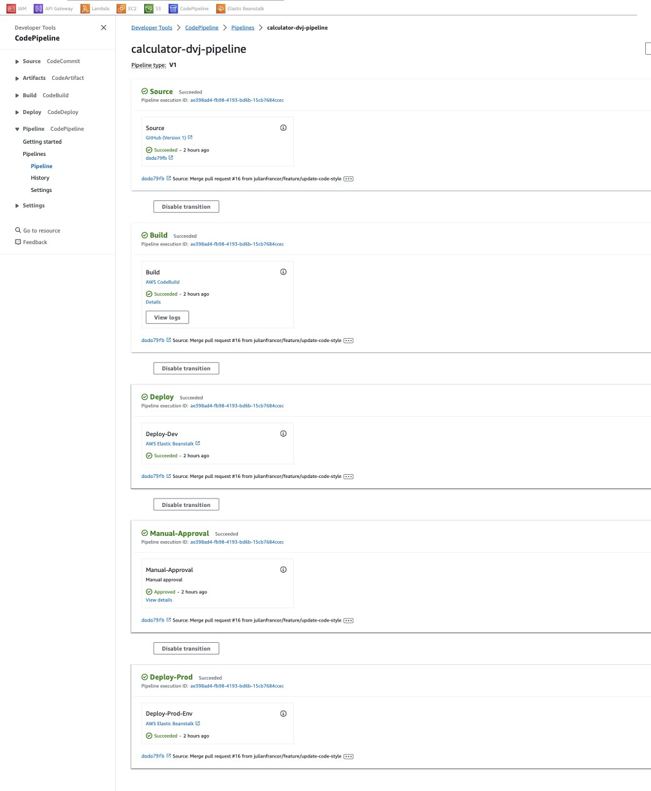

# Kotlin + Spring Boot Calculator App

## Introduction

This project is a basic calculator application built using Kotlin and Spring Boot. It allows users to perform standard arithmetic operations. This application was developed by David Roldan, Victor Muñoz, and Julian Franco as part of the CI/CD course at Eafit University in 2023.

## Continuous Integration (CI)

Continuous Integration (CI) is a software development practice that involves automatically integrating code changes from multiple contributors into a shared repository or branch several times a day. The main goal of CI is to ensure that new code additions or modifications do not disrupt the existing codebase.

Key points of Continuous Integration include:

1. **Automated Build Process**: CI systems automatically build and compile the code whenever a change is pushed to the repository. This helps catch compilation errors early.

2. **Automated Testing**: CI platforms run a suite of automated tests to verify that the newly integrated code functions as expected and does not introduce any regressions.

3. **Code Quality Checks**: Tools like linters, static code analyzers, and style checkers are used to maintain code quality and enforce coding standards.

4. **Early Detection of Issues**: CI helps identify and fix integration issues, conflicts, and bugs early in the development process, reducing the likelihood of major issues later on.

5. **Consistent Environments**: CI ensures that code is built and tested in a consistent environment, regardless of the developer's local setup.

6. **Automated Deployment (optional)**: While not a strict part of CI, some CI systems can be configured to automatically deploy code to a staging environment after successful builds and tests.

## Continuous Deployment (CD)

Continuous Deployment (CD) is an extension of Continuous Integration that goes one step further. It involves automatically deploying every code change that passes automated tests and quality checks directly into the production environment, without manual intervention.

Key points of Continuous Deployment include:

1. **Automated Deployment**: CD automates the process of releasing code changes to production. This reduces the time between writing code and seeing it in production.

2. **Rapid Delivery**: Continuous Deployment allows for rapid delivery of new features, bug fixes, and improvements to end-users.

3. **Reduced Human Error**: Since the deployment process is automated, it reduces the risk of human error during manual deployments.

4. **Rollbacks**: CD systems often have mechanisms in place to quickly rollback to a previous version in case a deployment introduces a critical issue.

5. **Monitoring and Feedback**: Continuous Deployment systems often include monitoring tools that provide immediate feedback on the health and performance of the deployed application.

6. **Feature Flags (optional)**: CD can be combined with feature flagging techniques, allowing developers to control the visibility of new features in production.

In summary, CI focuses on integrating and testing code changes frequently, while CD extends this by automating the deployment process to production. Together, CI/CD practices help ensure a streamlined and reliable software development and deployment pipeline.


## GitHub Actions for Continuous Integration (CI)

In this project, GitHub Actions was employed for Continuous Integration (CI). This involved automating the process of building, testing, and validating the codebase whenever changes were pushed to the repository. GitHub Actions provided a powerful and flexible platform for defining CI workflows directly within the GitHub repository.

### CI Workflow Steps:

1. **Checkout Code**: The repository's code was checked out to the GitHub Actions runner.

2. **Build**: The code was built using the necessary build tools (in this case, Kotlin + Maven for a Spring Boot application).

3. **Run Tests**: Automated tests were executed to ensure the functionality and integrity of the code.

4. **Code Quality Checks**: Tools like linters and static code analyzers were used to maintain code quality and enforce coding standards.

5. **Artifact Generation (optional)**: If applicable, artifacts like JAR files were generated as part of the build process.

6. **Publish Results**: The results of the build, including test reports and code quality metrics, were made available as artifacts or logs in GitHub Actions.

## AWS Services for Continuous Deployment (CD)

For Continuous Deployment (CD), AWS services were utilized, including AWS CodeBuild, AWS CodePipeline, and AWS Elastic Beanstalk. This combination allowed for an automated deployment pipeline from source code to a running application in AWS.

### CD Workflow:

1. **CodeBuild**: AWS CodeBuild was employed to build and package the application for deployment. It pulled the source code from GitHub, executed the necessary build steps, and generated deployable artifacts.

2. **CodePipeline**: AWS CodePipeline orchestrated the deployment process. It integrated with CodeBuild to manage the build and deployment stages. CodePipeline also provided the flexibility to define custom stages and actions as needed.

3. **Elastic Beanstalk**: AWS Elastic Beanstalk served as the deployment platform. It simplified the process of deploying and managing applications in AWS. Elastic Beanstalk automatically handled the deployment, scaling, and monitoring of the application.

4. **Testing (optional)**: Automated tests could be incorporated at various stages of the deployment process to ensure the application's functionality and reliability.

5. **Monitoring and Verification**: After deployment, monitoring tools within AWS could be used to verify the health and performance of the deployed application.

### Benefits of Using AWS Services for CD:

1. **Automated and Scalable**: AWS services provided a scalable and automated deployment process, ensuring consistent and reliable deployments.

2. **Managed Services**: AWS managed services like Elastic Beanstalk abstracted away the complexities of infrastructure management, allowing the team to focus on application development.

3. **Integration with AWS Ecosystem**: CodeBuild, CodePipeline, and Elastic Beanstalk seamlessly integrated with other AWS services, providing a comprehensive solution for CI/CD.

4. **Scalability and Cost-Efficiency**: AWS services could scale with the demands of the application, optimizing costs based on usage.

By combining GitHub Actions for CI and AWS services for CD, the project achieved an efficient and automated development and deployment pipeline, enhancing the overall development lifecycle.



## CI/CD Workshop - Design and Construction

## Getting Started

To run this application, follow these steps:

1. Clone the repository from GitHub:

   ```bash
   git clone https://github.com/julianfrancor/cicdapp-dvj.git
   ```

2. Open the project in your preferred IDE.

3. Run the application. You can access the API at `http://localhost:5000/api/index`.


Certainly! Here are the instructions to add to your README file in English:

---

## Run the Application with Docker

You can run the application using Docker by following these steps:

1. **Build the Docker Image**:

   Execute the following command to build the Docker image:

   ```bash
   docker build -t calculator_dvj_app .
   ```

   This will create a Docker image for your application based on the provided Dockerfile.

2. **Start the Container**:

   Once the image is built, you can start a container using the following command:

   ```bash
   docker run -p 8080:5000 calculator_dvj_app
   ```

   This will map port 8080 from the container to port 5000 on your local machine.

3. **Access the Application**:

   Open your web browser and go to the application at `http://localhost:8080/api/index`. The application should be up and running, ready for use.

---


## C4 Diagrams

### C4 System Diagram


### C4 Container Diagram


## CI/CD Diagram


## Course: CI/CD for Design and Construction

This project was developed as part of the "CI/CD for Design and Construction" course. The goal was to learn and apply Continuous Integration and Continuous Deployment practices in software development.

## Contributors

- David Roldan
- Victor Muñoz
- Julian Franco

---

*Note: This README provides an overview of the project and its main aspects. As the project evolves, more details and additional documentation will be added as needed.*